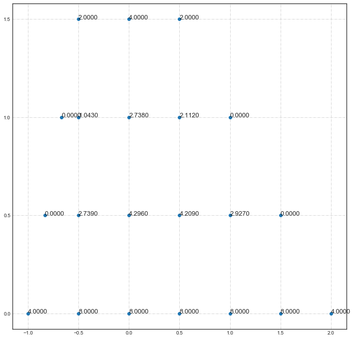
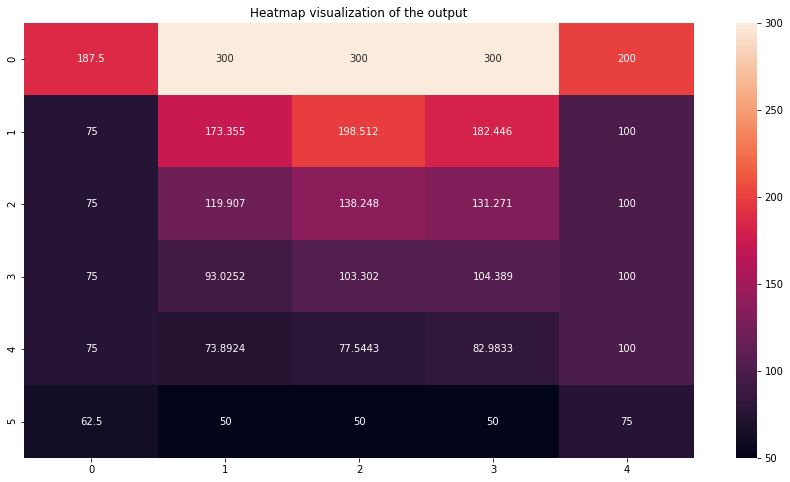

# PDE solver using the Finite Difference Method
## Features
- Solves PDEs with regular/irregular boundaries and initial values.
- The user can write and solve any second-order PDEs easily.
- A plot utility function to visualize the output.
- A Command line interface for the program.
- Note: You can start with the provided test cases.
<br/><br/>


## Example #1: Irregular boundaries
```python
boundary_points = {(-1, 0.0): 4, (-0.5, 0.0): 8, (0.0,0.0): 8, (0.5, 0.0): 8, (1.0, 0.0): 8, (1.5, 0.0): 8, (2.0, 0.0): 4, (-0.833, 0.5): 0, (1.5, 0.5) : 0,  (-0.6667, 1.0):0, (1.0,1.0): 0,  (-0.5, 1.5): 2, (0.0, 1.5): 4, (0.5, 1.5): 2}

Results = PDE_irregular_boundaries(boundary_points = boundary_points, h = 0.5, k = 0.5, uyy_coeff_fn = "1",  uxx_coeff_fn = "1", eqn_fn = "2")

Plot_results(Results, boundary_points, h=0.5, k =0.5 )
```
<p align="center">
  
</p>

<br/><br/>
## Example #2: Visualizing the heat transfer process 
After solving the PDEs with regular boundaries we plotted the points as a heat map to visualize the heat transfer problem using the Finite difference method. The same method can be used in Fluid mechanics and Electromagnetism problems<br/>
<p align="center">
  
</p>
